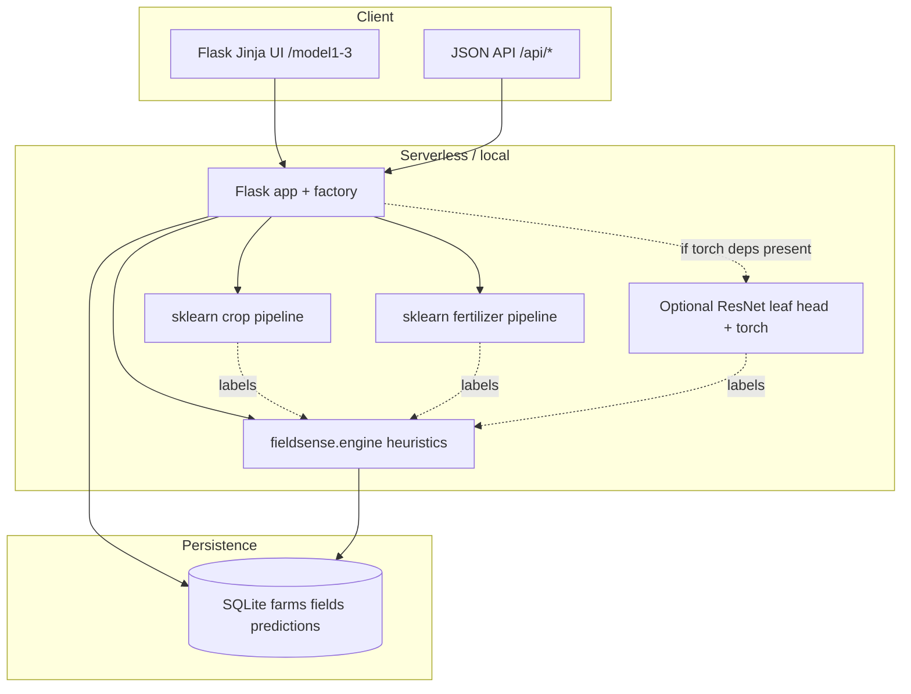

# FieldSense architecture

End-to-end flow from input to persisted, explainable output.

**Boundaries**

- **`app/`** — HTTP surface (routes, templates, static assets), WSGI entry, SQLite access, pickled sklearn artifacts.
- **`src/fieldsense/`** — importable library: engine rollups, data helpers, training-time model modules, shared logging.
- **`api/`** — Vercel Python entry (`sys.path` → `src/` + `app/`, then `from app import app`).
- **`experiments/`** — offline training/eval scripts; not loaded at runtime.

**Design choices**

- Heuristic **intelligence layer** (`compute_unified`) sits beside ML: same inputs power a health score and risk tier without pretending to be a second trained model.
- **SQLite** keeps the demo deployable without managed Postgres; `/tmp` on serverless implies ephemeral DB unless you plug external storage.
- **Pickle** for sklearn is a pragmatic artifact format; production hardening would mean pinned sklearn + `category_encoders` versions or ONNX export (see README roadmap).
